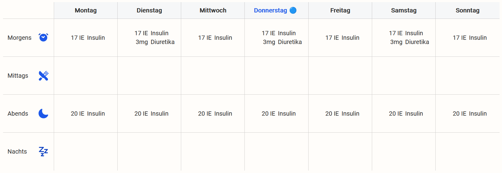
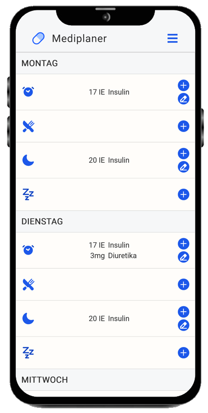

# mediplaner
**Ein Programm zum Planen von Medikamenteneinnahmen.**

Erleben Sie den ultimativen Komfort und die unschätzbare Ruhe, die Ihnen unser revolutionärer Medikamentenplaner bietet! Endlich gibt es eine einfache und elegante Lösung, um den Überblick über Ihre wertvollen Medikamente zu behalten – egal ob Sie unterwegs sind oder zu Hause am PC sitzen.

Verpassen Sie nicht die Chance, Ihren Medikamentenalltag zu revolutionieren! Nutzen Sie die Vorteile unseres erstklassigen Medikamentenplaners und genießen Sie endlich die Sorglosigkeit, die Sie verdienen. Überlassen Sie Ihre Medikationsverwaltung nicht dem Zufall – greifen Sie zu unserem Medikamentenplaner und erleben Sie die Freiheit einer organisierten und gesunden Lebensweise!


<h3>Nie wieder Medikamente vergessen!</h3>

<br>

## Möglicher Plan


<h3 align="center">Auch am Smartphone</h3>
<p align="center">
 
</p>

Mit der intuitiven Benutzeroberfläche haben Sie Ihre Medikamente jederzeit und überall im Griff. Egal, ob Sie ein Technikgenie oder ein Technikmuffel sind, unser Planer macht es Ihnen leicht, Ihre individuelle Medikationsliste einzutragen und zu verwalten.

Vergessen Sie die zeitaufwendige Suche nach Ihren Medikamenteninformationen – mit unserem Medikamentenplaner haben Sie alles, was Sie brauchen, auf einen Blick!


<h3>Verlassen Sie sich auf uns – wir lassen Sie nicht im Stich!</h3>

<br />

## CLOC (Count Lines Of Code)
Mit Hilfe des Programmes [**cloc**](https://github.com/AlDanial/cloc) wurden die Codezeilen gezählt um einen Überblick über die Projektgröße zu bekommen. Dazu wurde folgender Codeschnipsel ausgefüht.

```shell
cloc ./mediplaner --include-lang=PHP,CSS,JavaScript,HTML
```

Dies produziert folgende Ausgabe:


<br clear="left"/>
<br/>
Größe des Projektes (Bilder und JSON exkludiert): <b>380 KB</b>

## Poster

